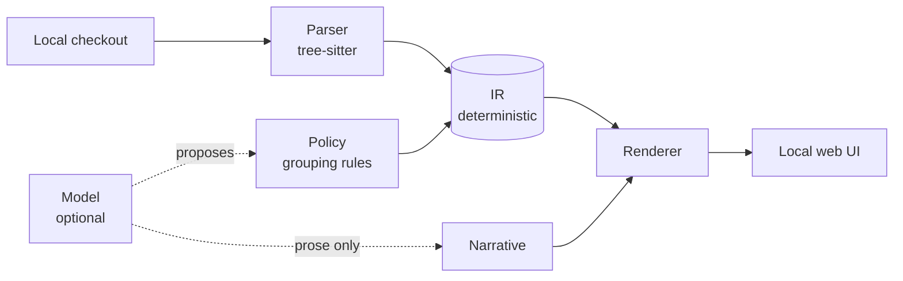
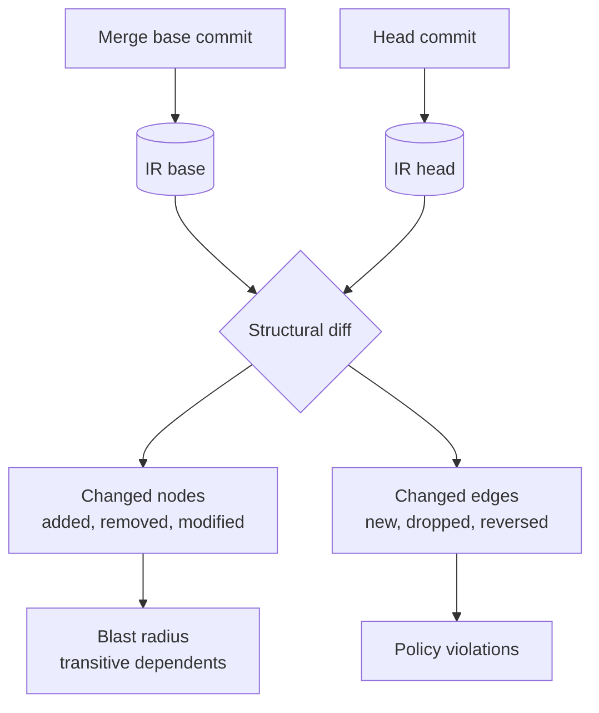

# Code Understanding & MR Diagramming — Requirements Draft

September 22, 2026 · @xb

## Problem & goal

One tool, two jobs that today need two different tools and neither does well.

**Job A — landing in unfamiliar code.** A developer opens a repo they did not write. They need the component topology, the direction of dependencies, and a path from a box on a diagram down to the function that implements it. A folder tree does not give this, because folders are rarely the architecture.

**Job B — reviewing a change.** An MR touches 40 files. The unified diff shows what changed, not what it changed about the system: which components gained a dependency, which module crossed a layer boundary, how far the blast radius reaches. Structural damage gets approved every week because the diff view cannot show structure.

**Goal:** a single locally-run binary that renders a repository's component topology as an interactive diagram, and renders any MR/PR as a structural delta over that same topology.

### Success criteria

- A developer new to a service can name its top-level components and their dependency directions in under 5 minutes, without opening a source file.
- A reviewer can see, before reading the diff, which components an MR adds, removes or re-wires — and whether it introduces a dependency pointing the wrong way.
- The tool runs offline against a local checkout. No source leaves the machine unless the operator explicitly turns on a model provider.

## Prior art

|  | uml-viewer | gitdiagram |
| --- | --- | --- |
| Source of truth | Language parser emits an EDN intermediate representation | LLM reads repo tree + README |
| Grouping | Policy file; namespaces are components, arbitrarily nested | Model infers groups from names and prose |
| Rendering | Live Quil desktop app, routes its own arrows | Mermaid compiled from a validated graph AST |
| Drill-down | Click through architecture to source | Click a node to open the file on GitHub |
| Extras | CRAP + mutation-score colouring from `.metrics/` snapshots | Streaming explanation, PNG export |
| Runs | Local, offline unless `--grok` | Hosted web app, needs a model provider |

### What we take

From uml-viewer: the deterministic pipeline. The parser writes the topology; the viewer displays it, routes the arrows and colours the metrics. The IR is a real artifact on disk, not a model's opinion. Two runs on the same commit produce the same diagram. Drill-down to source is the feature that makes a diagram worth opening twice.

From gitdiagram: the packaging and the safety rails. Architecture-level grouping rather than folder mirroring. A strict, size-bounded graph AST that a deterministic compiler turns into the rendered output. Every model-supplied path validated against the real repository before it is trusted, with invalid output retried against focused feedback. Mermaid rendered in strict security mode, SVG sanitised, link allowlist enforced in the browser.

### Where each falls short for us

- uml-viewer targets Clojure, needs Java 21 and the Clojure CLI, and renders to a desktop window — none of which survives our single-binary, browser-UI constraint. Its policy-and-agent loop also assumes a TUI agent session alongside the viewer.
- gitdiagram has no notion of a diff. It reads a repo tree and a README, so it cannot see call graphs or imports, and it cannot answer "what did this MR change structurally". It also requires the code to be on GitHub and the model to be reachable.

## Core decision: the model never authors the graph

Both source projects arrived at the same rule from opposite directions. uml-viewer states it directly — agents edit the policy, not the IR. gitdiagram enforces it structurally — the model returns a bounded AST, the server validates every identifier and every path against the real repository, and a deterministic compiler does the rendering.

We adopt it as the spine of the design.

The model may propose a policy and write prose. It may never emit a node, an edge or a file path that reaches the renderer.

### Why this matters here

- **Determinism.** Same commit, same flags, same diagram. Without this, an MR diff between two diagrams is meaningless — you cannot tell a real structural change from the model phrasing it differently on the second run.
- **Offline default.** Parsing and rendering need no network. A model provider is opt-in, and its absence degrades the tool to "no suggested grouping, no prose", not "no diagram".
- **Trust.** A reviewer acting on a diagram needs the edges to be real imports and real calls, not a plausible guess.

### Consequence for the policy file

Grouping is the one place judgement is needed and the parser cannot supply it. The policy is a checked-in file mapping source paths to components, with rules for layering. It is human-editable, diffable, and reviewable. The model's role is to propose an initial policy for a repo nobody has configured yet, and to suggest revisions — always as a patch the developer accepts or rejects.

## Mode A — understand an existing codebase

| # | Requirement | Priority |
| --- | --- | --- |
| A1 | Parse a local checkout into the IR without network access or a running build | Must |
| A2 | Group modules into components by policy; namespaces/packages are the default grouping when no policy exists | Must |
| A3 | Nest components to arbitrary depth; open a component to reveal its elements | Must |
| A4 | Render dependency edges with direction, derived from real imports and call sites | Must |
| A5 | Click any node to open the defining source at the right line | Must |
| A6 | Collapse and expand levels; hide edges below a configurable weight to declutter dense graphs | Must |
| A7 | Overlay metrics onto nodes as colour when a metrics snapshot is present; degrade silently when absent | Should |
| A8 | Flag cycles and layer violations against the policy's declared layering | Should |
| A9 | Search for a symbol and centre the diagram on its component | Should |
| A10 | Generate a plain-English architecture narrative when a model provider is configured | Could |
| A11 | Watch mode: re-parse and re-render on file change, preserving pan, zoom and open depth | Could |

### Language support

One parser interface, one implementation per language, shipped behind a capability list. v1 targets whatever our own repos are written in; everything else reports "unsupported, 0 files parsed" rather than silently producing an empty diagram.

A repo with an unsupported language should still get a file-and-import-level graph if the imports are statically greppable — a degraded but honest view beats nothing.

### What Mode A must not do

- Mirror the folder tree and call it an architecture.
- Show an edge it cannot attribute to a specific source location.
- Require the project to be on GitHub, or to have a README.

## Mode B — MR/PR change diagramming

The mechanism follows from Mode A: parse the merge base, parse the head, diff the two IRs. Neither source project does this, and it is the reason to build rather than fork.

| # | Requirement | Priority |
| --- | --- | --- |
| B1 | Build IRs for two refs and diff them structurally, not textually | Must |
| B2 | Classify every node as added, removed, modified or untouched, and colour it accordingly | Must |
| B3 | Classify every edge as new, dropped or unchanged; call out a reversed dependency explicitly | Must |
| B4 | Compute blast radius: the transitive set of components depending on anything modified, with hop distance | Must |
| B5 | Default the view to the changed subgraph plus one hop, with the full graph one click away | Must |
| B6 | Link each changed node to its hunk in the MR, and to the source at that ref | Must |
| B7 | Report new policy violations introduced by the change — layer crossings, new cycles — separately from pre-existing ones | Should |
| B8 | Emit a machine-readable summary for CI to post as an MR comment | Should |
| B9 | Exit non-zero when a configured structural rule is newly violated | Should |
| B10 | Summarise the structural intent of the change in prose when a model provider is configured | Could |

### Review-facing output

The diagram is the primary artifact, but a reviewer skimming an MR comment needs three lines before they decide to open it:

1. What components this touches, by name.
2. What dependencies it adds or removes.
3. Whether it newly violates a structural rule.

The pre-existing-versus-new distinction in B7 is load-bearing. A tool that reports every cycle in a legacy codebase on every MR gets muted within a week.

### Open design question

Blast radius on a large monorepo can reach most of the graph. Two candidate mitigations: cap by hop distance with a configurable default, or weight edges by coupling strength and cut below a threshold. Needs a real repo to decide.

## The IR contract

The IR is the only thing the renderer reads. It is written to disk, versioned independently of the application, and diffable by hand.

| Field | Holds | Notes |
| --- | --- | --- |
| `schemaVersion` | IR format version | Renderer refuses an IR it does not understand rather than half-drawing it |
| `commit` | The ref this IR describes | Required for Mode B pairing |
| `nodes[]` | id, kind, name, parent, source location | `kind` = component, module, type, function |
| `edges[]` | from, to, kind, source locations | `kind` = imports, calls, implements, extends |
| `policyHash` | Hash of the policy that produced the grouping | A diagram diff is only valid across IRs with the same hash |
| `metrics?` | Per-node overlay values, keyed by node id | Optional, loaded from a separate snapshot |
| `parseErrors[]` | Files that failed to parse, with reasons | Surfaced in the UI; silence here is how tools lie |

### Rules

- Every node carries a real source location: path, line, and the ref it was read at. A node without one is a bug, not a placeholder.
- Every edge carries at least one source location justifying it.
- Node ids are stable across runs and derived from the source identity, not from render order. Mode B's whole diff depends on this.
- `policyHash` mismatch between two IRs makes them undiffable. The CLI says so rather than producing a diff that is mostly noise from a re-grouping.

### Metrics overlay

Metrics come from snapshot files produced by tools we do not own — coverage reports, mutation runs, complexity output. The IR references them by node id; it does not compute them. Adding a new metric source means writing a reader, not touching the parser.

### Storage

Generated IRs, policies and caches live under a single ignored directory in the repo. They contain local paths and source identities, so the default `.gitignore` entry ships with the tool. Policy is the exception — it is meant to be committed and reviewed.

## CLI surface

One binary, subcommands, no daemon.

| Command | Does | Output |
| --- | --- | --- |
| `scan` | Parse the checkout, write the IR | IR file, parse-error summary on stderr |
| `serve` | Scan if needed, then open the local web UI | URL on stdout, server in foreground |
| `diff <base> <head>` | Build both IRs and diff them | Structural delta, rendered or serialised |
| `check` | Evaluate policy rules against the current IR | Violations on stdout, exit code |
| `policy init` | Generate a starting policy from the repo's own structure | Policy file, never overwriting an existing one |
| `policy suggest` | Propose policy revisions via the model provider | A patch to review; never applied automatically |

### Flags that matter

- `-out` / `-format json|mermaid|svg` — for piping into CI or a doc.
- `-no-model` — hard-disables any provider call regardless of configuration. Present so it can be set globally in a CI image.
- `-open` on `serve` — launches the browser; off by default so CI use never tries.
- `-port` — defaults to a fixed port, falls back to a free one and says which.

### Exit codes

| Code | Meaning |
| --- | --- |
| 0 | Success, no violations |
| 1 | Structural rule violated (`check`, `diff --strict`) |
| 2 | Parse failure above the configured tolerance |
| 3 | Bad invocation or unreadable config |

### CI usage

The MR pipeline runs `diff` against the merge base with `--format json` and posts the summary. It must work with no model provider, no browser and no display. Everything the pipeline needs is on stdout; nothing requires the server.

### Standalone viewing

Opening a diagram must not start an agent, require a model account, or assume the current working directory is the repo. The uml-viewer issue tracker has this exact problem open — viewing is entangled with agent ownership and implicit filesystem context. We separate them from the start: explicit project root, explicit allowlisted paths for source, policy, metrics and output, and traversal or escaping-symlink rejection before any I/O.

## Web UI

Served from the binary on localhost. The UI is where most of the build effort goes — the diagram is interactive, not a rendered image.

### Diagram canvas

| # | Requirement | Priority |
| --- | --- | --- |
| U1 | Pan, zoom, fit-to-view; state preserved across re-renders in watch mode | Must |
| U2 | Expand and collapse a component in place, without re-laying out the whole graph | Must |
| U3 | Automatic layout with stable positions: the same IR lays out the same way every time | Must |
| U4 | Select a node to highlight its direct dependencies and dependents, dimming the rest | Must |
| U5 | Side panel showing the selected node's source, metrics and edges | Must |
| U6 | Declutter control: hide leaf nodes, weak edges, or everything outside the selection's neighbourhood | Must |
| U7 | Export the current view as SVG or PNG | Should |
| U8 | Keyboard navigation: search, jump to node, escape to clear selection | Should |

### Diff view

| # | Requirement | Priority |
| --- | --- | --- |
| U9 | Colour nodes and edges by change class, with a legend | Must |
| U10 | Toggle between changed-subgraph and full-graph | Must |
| U11 | Changed-components list beside the canvas, clicking one centres it | Must |
| U12 | Show the hunk for a changed node inline in the side panel | Should |
| U13 | Before/after toggle on a single component's internals | Could |

### Rendering choice

Mermaid is the wrong primitive here, despite gitdiagram using it. It produces a picture; we need a graph the user manipulates — expand in place, dim neighbourhoods, stable node identity across re-renders. Mermaid is worth keeping only as an export format.

Proposed: a node-graph library with custom node components, plus a layout engine run in a worker so large graphs do not block interaction. Layout must be deterministic given the same IR — a graph that reshuffles on every render makes Mode B unreadable.

### Safety

The server binds to localhost only. Source content rendered in the browser is escaped; no source path from the IR is turned into a link without validating it resolves inside the declared project root. Model-generated prose is rendered as text, never as markup.

## Non-functional requirements

### Distribution

| # | Requirement |
| --- | --- |
| N1 | One executable. No runtime to install — not Java, not a Clojure CLI, not Node |
| N2 | Cross-compiled for macOS arm64/x64 and Linux x64 from one build host |
| N3 | Web assets embedded in the binary; no separate asset directory to ship |
| N4 | Every release records source commit, application version, IR schema version and a digest per artifact file |

N4 comes straight from uml-viewer's packaging issue. Application version, IR schema version and policy format version move independently, and a consumer needs to know exactly which combination they tested.

### Performance budgets

Targets, to be validated against a real repo before they are commitments:

- Cold scan of a 100k-LOC repo: under 30 seconds.
- Incremental re-scan after one file changes: under 2 seconds.
- First paint of a 500-node graph: under 3 seconds.
- Interaction stays responsive at 2,000 nodes with collapsing on.

Above those sizes the tool should degrade by collapsing depth automatically and saying so, not by hanging.

### Privacy and security

- Source and generated diagrams stay on the machine. No telemetry.
- No model provider is contacted unless one is explicitly configured, and `-no-model` overrides any configuration.
- When a provider is configured, the UI states plainly what gets sent before the first call.
- Path handling rejects traversal and symlinks escaping the declared roots before any read or write.
- Opening a diagram generated elsewhere is treated as untrusted input: its paths and policies refer to someone else's filesystem. Validate before resolving.

### Licensing

Decide before first distribution. uml-viewer currently ships without a LICENSE, which blocks redistribution for anyone downstream. gitdiagram is MIT. If we vendor or port any code from either, the obligation follows the code.

## Scope and open questions

### Explicitly out of v1

- Multi-repo or cross-service topology. One checkout at a time.
- Runtime or trace-derived edges. Static analysis only.
- Editing code from the diagram. The uml-viewer agent loop — propose a design, then make the code match — is a genuinely interesting direction and a different product. Read-only until the read-only path is good.
- Hosted deployment, accounts, sharing. Local binary only.
- Sequence diagrams, ER diagrams, any second diagram type.

### Suggested build order

1. Parser and IR for one language. No UI, `scan` writes a file, correctness verified against a repo we know.
2. `serve` with a static rendering of that IR. No interaction beyond pan and zoom.
3. Interaction: expand, collapse, select, drill to source. This is where Mode A becomes useful.
4. Policy file and grouping. Until here, grouping is packages.
5. `diff` and the change view. Mode B.
6. Model provider for policy suggestions and prose. Last, and optional throughout.

Stopping after 3 still leaves something worth using daily. That is the test of whether the order is right.

### Open questions

- Which language does v1 target, and does that decision change the implementation-language choice?
- Blast-radius bounding: hop cap or coupling-weight threshold? Needs a real MR to decide.
- Does the MR mode integrate with GitLab's API, or read refs from a local clone only? The local-only path is simpler and works offline; the API path gives inline MR comments.
- Metrics: which snapshot formats do we read first, and do we have coverage and complexity data available per-module today?
- Is `policy` one file or per-component files? Per-component diffs better in MRs; one file is easier to reason about.
- Do we need to handle generated code, vendored dependencies and test files as separate node classes, or is exclusion by glob enough?
